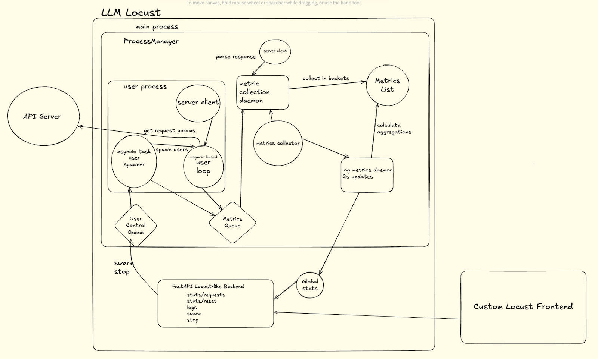

# LLM Locust

## Running Locust WebUI and Backend Seperatly
WebUI
```bash
cd webui && yarn && yarn run dev
```
Backend
```bash
python api.py
```

## Build Locust WebUI and serve via backend
```bash
cd webui && yarn && yarn run build
cd .. && python api.py
```

# How it works

