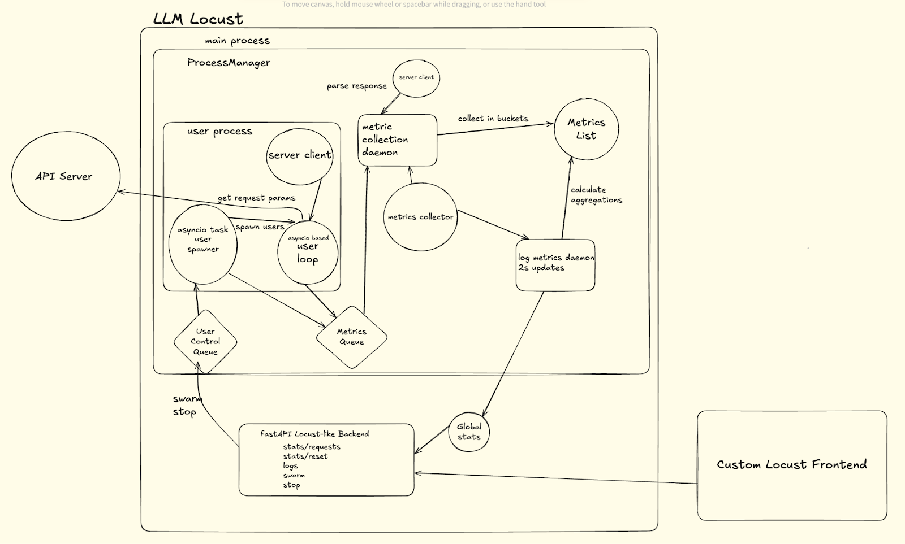

# LLM Locust

## Running Locust WebUI and Backend Seperatly
WebUI
```bash
cd webui && yarn && yarn run dev
```
Backend
```bash
python api.py
```

## Build Locust WebUI and serve via backend
```bash
cd webui && yarn && yarn run build
cd .. && python api.py
```

## Running with Docker Compose

The easiest way to get started is with Docker Compose. It builds the frontend and backend into a single image and pre-downloads the default tokenizer so the container can run offline.

```bash
docker compose up --build
```

The UI will be available at `http://localhost:8089`.

### Customizing the tokenizer

To cache a different tokenizer model during the build:

```bash
docker compose build --build-arg TOKENIZER_MODEL=meta-llama/Llama-2-7b-hf
docker compose up
```

### Running fully offline

After building the image with the desired tokenizer, enable offline mode so no network calls are made at runtime:

```bash
# In docker-compose.yml, uncomment the HF_HUB_OFFLINE line, then:
docker compose up
```

## Running with Docker (without Compose)

```bash
docker build -t llm-locust .
docker run -p 8089:8089 llm-locust
```

To pass CLI arguments:

```bash
docker run -p 8089:8089 llm-locust --host http://your-llm-server:8000 --model your-model-name
```

# How it works

